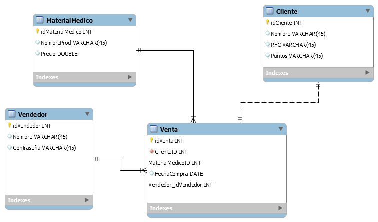

# Proyecto Deposito de Material Medico

## Manejador de base de datos

- MariaDB



## Se quiere hacer una tienda de productos medicos

### Vendedor

- El vendedor tiene a su cargo el portal donde vende, recive el dinero y da tickets a los clientes

- Para poder vender tiene que poner su contraseña y nombre

## Material Medico

- Material medico esta catalogado por su id, nombre y precio
  
## Clientes

- Los clientes pueden ser registrados en la tienda y estos generan puntos en sus compras

- Los clientes tambien se les puede imprimir la factura, para eso hay que registrarlos y pedir su RFC

## Venta

- Cuando el Vendedor hace la venta este debe entregar el ticket, este indicara a que cliente se le hizo

- Fecha de venta
 
- El material comprado.

## Tecnologia Usadas

- NPM

- NodeJS

### Paquetes installados

- bcrypt
  
    ```<JavaScript>
    npm i bcrypt
    ```

- cors

    ```<JavaScript>
    npm i cors
    ```

- express

    ```<JavaScript>
    npm i express
    ```

- helmet

    ```<JavaScript>
    npm i express
    ```

- jsonwebtoken
  
    ```<JavaScript>
    npm i jsonwebtoken
    ```

- mariadb

    ```<JavaScript>
    npm i mariadb
    ```

- sequelize

    ```<JavaScript>
    npm i sequelize
    ```
